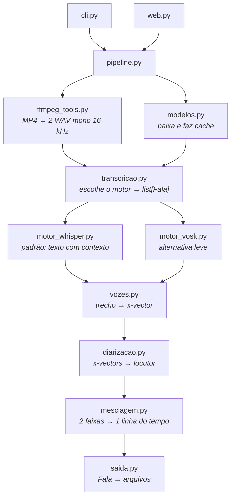

# Arquitetura

Como o projeto está organizado e onde mexer para estendê-lo.

Para instalar e operar, veja o [guia de uso](uso.md).

---

## Princípio de organização

Cada módulo resolve uma etapa e não conhece as outras. Eles se comunicam por uma
estrutura só, [`Fala`](../transcritor/fala.py) — início, fim, texto, faixa,
locutor e vetor de voz —, que atravessa todo o processo. `pipeline.py` é o único
lugar que conhece a ordem das etapas; `cli.py` e `web.py` são cascas finas sobre
ele.

Consequência prática: trocar o motor de reconhecimento, o algoritmo de separação de
vozes ou o conjunto de formatos de saída afeta um módulo só.

**Falas simultâneas nunca são descartadas.** As duas faixas correm em paralelo e
se sobrepõem o tempo todo. Nenhuma etapa elimina uma fala por coincidir no tempo
com a de outra pessoa: `mesclagem.mesclar` só funde falas seguidas **do mesmo
locutor e da mesma faixa**, e `saida` grava o tempo final real de cada uma — uma
legenda não é encurtada porque a próxima começa antes de ela terminar.
`mesclagem.sobrepostas` diz quais falas dividiram o tempo, e é o que alimenta o
campo `sobreposta` do `.detalhado.json`. Há testes travando isso em
`test_mesclagem.py` e `test_saida.py`; ao mexer nesses módulos, mantenha-os.

**Texto e voz são etapas separadas.** O motor de reconhecimento entrega só o texto
com os tempos; quem caracteriza a voz de cada trecho é `vozes.py`, depois. Foi o que
permitiu trocar o motor padrão sem tocar na separação de locutores — e é por isso
que os dois motores convivem sem um saber do outro.



## Módulos

| Módulo | Responsabilidade | Importa |
|---|---|---|
| `fala.py` | A estrutura `Fala`, trocada entre todos os módulos | nada |
| `ffmpeg_tools.py` | Localiza o ffmpeg, lê as faixas do container, extrai WAV 16 kHz mono | `imageio_ffmpeg` |
| `modelos.py` | Catálogo, download e cache dos modelos dos dois motores | `requests`, `tqdm`, `faster_whisper` |
| `motor_whisper.py` | Reconhecimento com Whisper: texto pontuado e ciente do contexto | `fala`, `faster_whisper` |
| `motor_vosk.py` | Reconhecimento com Vosk: leve, sem pontuação | `fala`, `vosk` |
| `transcricao.py` | Escolhe o motor pelo modelo e prepara o WAV | `motor_*`, `modelos`, `pytranscript` |
| `vozes.py` | Extrai o x-vector de cada trecho, seja qual for o motor | `fala`, `vosk`, `numpy` |
| `diarizacao.py` | Agrupa os x-vectors em locutores | `fala`, `numpy`, `scipy` |
| `mesclagem.py` | Intercala as faixas numa linha do tempo só e aponta as simultâneas | `fala` |
| `saida.py` | Gera os arquivos, estendendo o `Transcript` do `pytranscript` | `fala`, `mesclagem`, `pytranscript` |
| `pipeline.py` | Orquestra as etapas e reporta progresso | todos os acima |
| `cli.py` / `web.py` | As duas interfaces | `pipeline`, `ffmpeg_tools`, `modelos`, `saida` |

A dependência anda sempre para cima nesta tabela: nenhum módulo importa outro que
esteja abaixo dele. `fala.py` não importa nada — nem do projeto, nem de fora —, e é
dele que vem a `Fala` usada por todos os seguintes. Foi separado de `transcricao.py`
justamente para que os motores pudessem importá-la sem ciclo.

### Os dois motores de reconhecimento

| | `motor_whisper.py` (padrão) | `motor_vosk.py` |
|---|---|---|
| Como decide a palavra | Janelas de 30 s, levando em conta o que já transcreveu | n-gramas locais |
| Pontuação e maiúsculas | Sim | Não |
| Nomes próprios | Aceita uma dica de contexto que os enviesa | Sem como informar |
| Hardware | GPU NVIDIA, ou CPU (mais lento) | CPU |
| Vetores de voz | Não calcula — ficam a cargo de `vozes.py` | Pode devolver na mesma passada |

Os dois expõem a mesma função `transcrever(...) -> list[Fala]` e não se conhecem.
Quem escolhe é `transcricao.transcrever`, olhando o campo `motor` do modelo que
`modelos.resolver_modelo_fala` devolveu — a decisão mora no modelo, não em quem
transcreve.

O Vosk continua sendo dependência mesmo com o Whisper no comando: é dele que sai o
modelo de x-vectors que `vozes.py` usa para separar as vozes dos jogadores.

### Ter GPU e poder usar a GPU

São perguntas diferentes, e confundi-las custava um erro no meio da transcrição:
o CTranslate2 enxerga a placa só com o driver instalado, mas falha ao carregar a
cuBLAS se as bibliotecas CUDA não estiverem lá. `diagnosticar_cuda()` responde a
segunda pergunta — carrega o que encontrou e confere se os nomes que o
CTranslate2 vai procurar resolvem — e `escolher_dispositivo` só devolve `cuda`
quando ela diz que sim. O resto do projeto consome isso por um caminho só:

```
diagnosticar_cuda()
  ├─ escolher_dispositivo()      decide, ou explica a quem pediu cuda
  ├─ transcricao.aviso_de_dispositivo()  vira aviso no Resultado
  └─ cli "diagnostico"           o que o usuário roda e cola num relato
```

Os scripts do Windows usam o mesmo `get_cuda_device_count()` para decidir se
instalam a CUDA, e o instalador confere o resultado chamando
`transcritor diagnostico`. É deliberado: quando a instalação e a execução
perguntam coisas diferentes, a divergência só aparece transcrevendo.

### Onde as dependências são declaradas

| Arquivo | Papel |
|---|---|
| `pyproject.toml` | Faixas abertas (`>=`) das dependências diretas. É o que vale quando o projeto é instalado como pacote. |
| `requirements.txt` | Versões fixas (`==`) de tudo, diretas e transitivas. Reproduz o ambiente em que o projeto foi testado. |

Os dois andam juntos: ao acrescentar uma biblioteca, declare a faixa no
`pyproject.toml` e regenere o `requirements.txt` a partir do ambiente
(`uv pip freeze | grep -v '^-e ' > requirements.txt`). O procedimento de instalação
está no [guia de uso, seção 2.3](uso.md#23-dependências).

### O que é específico de cada sistema

O projeto roda igual no Linux, no macOS e no Windows. Três pontos precisam saber
em qual deles estão — e são só três:

| Onde | O quê |
|---|---|
| `requirements.txt` | O `uvloop` tem marcador de plataforma: não existe wheel dele para Windows, e sem o marcador `pip install -r` falharia inteiro lá. |
| `motor_whisper._carregar_bibliotecas_cuda` | As bibliotecas CUDA do pip são `.so` em `lib/` no Linux e `.dll` em `bin/` no Windows. No Windows não basta registrar o diretório: as DLLs são pré-carregadas pelo caminho absoluto, porque uma biblioteca já carregada é encontrada pelo nome sem busca. |
| `saida._gravar` e `cli._saida_em_utf8` | A codificação padrão do Windows é cp1252. Os arquivos são gravados em UTF-8 explícito, e a saída do terminal é reconfigurada — senão um travessão interromperia a gravação. |

Dois scripts cobrem o Windows, cada um com um atalho `.cmd` que contorna a
política de execução do PowerShell:

| Script | O que faz |
|---|---|
| `scripts/instalar-windows.ps1` | Ambiente virtual, dependências e, havendo GPU, as bibliotecas CUDA. |
| `scripts/iniciar-windows.ps1` | Confere o ambiente (instalando se faltar), baixa o modelo em paralelo, sobe o servidor, espera ele responder e abre o navegador. |

Nenhum dos dois duplica regra do projeto: o primeiro chama o mesmo
`requirements.txt` e o mesmo `requirements-gpu.txt`; o segundo chama o primeiro e
pergunta ao próprio pacote o que precisa saber (dispositivo, modelos em cache,
modelo padrão), em vez de repetir esses valores. `tests/test_instalacao.py` trava
o empacotamento que um `uv pip freeze` distraído desfaria, e `test_web.py` trava
o campo da API que o `iniciar` usa para saber que a aplicação subiu.

### A imagem do container

O `Dockerfile` instala a partir do `requirements.txt`, e não do `pyproject.toml` —
é o que torna a imagem reproduzível. Ele não duplica configuração do projeto: o
entrypoint é o próprio executável `transcritor`, então as duas interfaces saem da
mesma imagem, e o único ajuste de ambiente é `TRANSCRITOR_MODELOS=/modelos`, que
aponta o cache dos modelos para um volume.

| Caminho no container | Conteúdo |
|---|---|
| `/app` | Código, instalado em modo editável. Diretório de trabalho, o que faz `-o saida/...` cair em `/app/saida`. |
| `/modelos` | Cache dos modelos de fala (Whisper e Vosk), em volume nomeado. |
| `/midia` | Gravações de entrada, somente leitura. |
| `/app/dados` | `RAIZ_TRABALHOS` do `web.py`, que é relativa ao diretório de trabalho. |

Ao mexer nesses caminhos, lembre que `web.py` resolve `dados/trabalhos` a partir do
diretório de trabalho: mudar o `WORKDIR` muda onde os envios da interface caem.

O `docker-compose.yml` é versionado e não carrega nada específico de uma máquina: os
caminhos do host, a porta e o UID saem de variáveis com valor padrão
(`${TRANSCRIBEFY_SAIDA:-./saida}` e companhia), preenchidas por um `.env` local a
partir do [`.env.exemplo`](../.env.exemplo). É o que permite apontar a saída para uma
pasta do Windows sem editar — nem versionar — a configuração de ninguém. O uso está
em [`docs/docker.md`](docker.md).

## O que foi estendido do `pytranscript`

A biblioteca cobre transcrição de faixa única sem noção de locutor. Dois pontos
foram estendidos em vez de substituídos:

- **`TranscricaoComLocutores`** (`saida.py`) herda de `pytranscript.Transcript` e
  sobrescreve `srt_generator` para usar o tempo final real de cada fala, no lugar da
  estimativa fixa de 5 segundos do original — e, diferente dele, não encurta uma
  legenda porque a seguinte começa antes: é o que preserva as interrupções.
  `to_vtt`, `write` e os demais formatos vêm de graça.
- **`_traduzir`** (`saida.py`) reinsere as linhas que `Transcript.translate`
  descartaria em silêncio, preservando o alinhamento dos tempos.

O laço de reconhecimento em `motor_vosk.py` é próprio, e não o
`pytranscript.transcribe`, porque precisamos de dois dados que a função original
joga fora: o tempo final da fala e o vetor de voz. De `pytranscript` ficam a
conversão para WAV válido (`transcricao.preparar_wav`) e os formatos de saída.

---

## Pontos de extensão

### Adicionar um formato de saída

1. Inclua o sufixo em `saida.FORMATOS`.
2. Trate-o no laço de `saida.escrever`, como é feito com o `md`.

O `else` desse laço delega para `Transcript.write` do `pytranscript`, que cobre
`csv`, `json`, `srt`, `txt` e `vtt` — os cinco já estão na lista, então qualquer
formato novo é necessariamente um formato do projeto e precisa do passo 2.

A CLI e a interface web passam a gerá-lo automaticamente: as duas montam seu valor
padrão a partir de `FORMATOS`.

### Adicionar um modelo de fala

Uma entrada em `modelos.MODELOS_FALA`, declarando o motor que a acompanha:

```python
"medio": Modelo(
    "medio", MOTOR_WHISPER, "medium",
    "Whisper medium — meio-termo entre 'leve' e 'preciso'", 1530,
),
"es-pequeno": Modelo(
    "es-pequeno", MOTOR_VOSK, "vosk-model-small-es-0.42",
    "Espanhol compacto", 39,
),
```

A `referencia` é o id no Hugging Face para o Whisper e o nome do zip para o Vosk;
`garantir_modelo` já trata os dois casos. O download e o cache estão resolvidos, e o
apelido aparece sozinho em `transcritor modelos` e no seletor da interface web.

Para um teste rápido nem isso é necessário: qualquer tamanho conhecido do Whisper
(`-m medium`, `-m distil-large-v3`) ou o caminho de um modelo já em disco também são
aceitos — nesse caso o motor é deduzido do conteúdo da pasta.

### Adicionar um motor de reconhecimento

1. Um módulo `motor_<nome>.py` com `transcrever(...) -> list[Fala]`.
2. Uma constante `MOTOR_<NOME>` e as entradas correspondentes em
   `modelos.MODELOS_FALA`, mais o tratamento em `modelos.garantir_modelo`.
3. Um ramo em `transcricao.transcrever`.

Preencher os vetores de voz é opcional: quando o motor não os devolve, o `pipeline`
chama `vozes.anexar_vetores` e a separação de locutores segue igual.

### Trocar o algoritmo de separação de vozes

`diarizacao.atribuir_locutores` recebe `list[Fala]` em ordem cronológica e devolve a
mesma lista com o campo `locutor` preenchido. Qualquer implementação que respeite
esse contrato serve — inclusive uma que ignore os x-vectors do Vosk e chame outra
biblioteca.

O `pipeline` não conhece nada do algoritmo além dessa chamada.

### Adicionar uma interface

`pipeline.executar(Configuracao, relatar)` é o ponto de entrada único. O `relatar` é
um callback `(mensagem, fração)` para progresso. Uma nova interface só precisa
montar a `Configuracao` e consumir o `Resultado`.

---

## Testes

```bash
.venv/bin/python -m pytest tests -q
```

O `pytest` já faz parte do `requirements.txt`, com a versão fixa.

Não precisam de modelos nem de rede: o relatório do ffmpeg é uma string fixa, os
vetores de voz são sintéticos e os segmentos do Whisper vêm de objetos falsos. Isso
mantém a suíte rápida o bastante para rodar a cada alteração.

| Arquivo | Cobre |
|---|---|
| `test_ffmpeg_tools.py` | Leitura das faixas a partir do relatório do ffmpeg |
| `test_modelos.py` | Catálogo, apelidos antigos e detecção do motor pelo caminho |
| `test_motor_whisper.py` | Quebra dos segmentos em falas e descarte de alucinações |
| `test_vozes.py` | Média ponderada dos x-vectors de um trecho |
| `test_diarizacao.py` | Agrupamento, nomeação, falas curtas e suavização |
| `test_mesclagem.py` | Intercalação, agrupamento, deslocamento e falas simultâneas |
| `test_saida.py` | Formatos, tempos das legendas, falas simultâneas e tradução parcial |
| `test_pipeline.py` | Validações e montagem do contexto antes de transcrever |
| `test_web.py` | Contrato entre a API e o formulário da página |
| `test_instalacao.py` | O que a instalação no Windows exige do empacotamento |

### O teste do container

`scripts/teste-container.sh` cobre o que o `pytest` não alcança: a imagem, os
volumes, as permissões dos arquivos gerados e a interface web respondendo de
verdade por HTTP. É lento, exige Docker e rede, e por isso vive fora da suíte — o
lugar dele é depois de mexer no `Dockerfile`, no compose ou nas dependências. Ele
se isola numa pasta, num volume e numa porta próprios, então não atrapalha um
container já rodando. O uso está em
[`docs/docker.md`, seção 11](docker.md#11-teste-automatizado).

O `test_web.py` merece destaque: ele lê o HTML da interface e confere que todo campo
enviado pelo formulário existe como parâmetro do endpoint, e que toda propriedade
lida pelo JavaScript existe no payload da API. É o teste que pega quebras de
contrato entre as duas metades da aplicação web, que nenhum dos outros veria.
