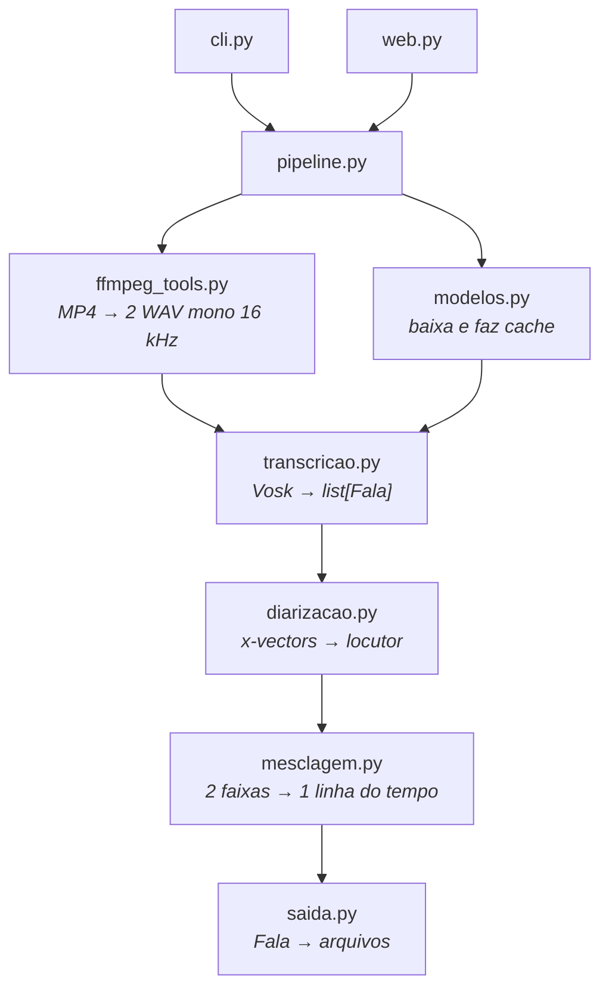

# Arquitetura

Como o projeto está organizado e onde mexer para estendê-lo.

Para instalar e operar, veja o [guia de uso](uso.md).

---

## Princípio de organização

Cada módulo resolve uma etapa e não conhece as outras. Eles se comunicam por uma
estrutura só, [`Fala`](../transcritor/transcricao.py) — início, fim, texto, faixa,
locutor e vetor de voz —, que atravessa todo o processo. `pipeline.py` é o único
lugar que conhece a ordem das etapas; `cli.py` e `web.py` são cascas finas sobre
ele.

Consequência prática: trocar o motor de reconhecimento, o algoritmo de separação de
vozes ou o conjunto de formatos de saída afeta um módulo só.



## Módulos

| Módulo | Responsabilidade | Importa |
|---|---|---|
| `ffmpeg_tools.py` | Localiza o ffmpeg, lê as faixas do container, extrai WAV 16 kHz mono | `imageio_ffmpeg` |
| `modelos.py` | Baixa e faz cache dos modelos Vosk | `requests`, `tqdm` |
| `transcricao.py` | Roda o Vosk guardando tempo inicial/final e x-vector por fala | `pytranscript`, `vosk` |
| `diarizacao.py` | Agrupa os x-vectors em locutores | `transcricao`, `numpy`, `scipy` |
| `mesclagem.py` | Intercala as faixas numa linha do tempo só | `transcricao` |
| `saida.py` | Gera os arquivos, estendendo o `Transcript` do `pytranscript` | `transcricao`, `pytranscript` |
| `pipeline.py` | Orquestra as etapas e reporta progresso | todos os acima |
| `cli.py` / `web.py` | As duas interfaces | `pipeline`, `ffmpeg_tools`, `modelos`, `saida` |

A dependência anda sempre para cima nesta tabela: nenhum módulo importa outro que
esteja abaixo dele. `transcricao.py` não importa nada do projeto, e é dele que vem a
`Fala` usada por todos os seguintes.

### Onde as dependências são declaradas

| Arquivo | Papel |
|---|---|
| `pyproject.toml` | Faixas abertas (`>=`) das dependências diretas. É o que vale quando o projeto é instalado como pacote. |
| `requirements.txt` | Versões fixas (`==`) de tudo, diretas e transitivas. Reproduz o ambiente em que o projeto foi testado. |

Os dois andam juntos: ao acrescentar uma biblioteca, declare a faixa no
`pyproject.toml` e regenere o `requirements.txt` a partir do ambiente
(`uv pip freeze | grep -v '^-e ' > requirements.txt`). O procedimento de instalação
está no [guia de uso, seção 2.2](uso.md#22-dependências).

## O que foi estendido do `pytranscript`

A biblioteca cobre transcrição de faixa única sem noção de locutor. Dois pontos
foram estendidos em vez de substituídos:

- **`TranscricaoComLocutores`** (`saida.py`) herda de `pytranscript.Transcript` e
  sobrescreve `srt_generator` para usar o tempo final real de cada fala, no lugar da
  estimativa fixa de 5 segundos do original. `to_vtt`, `write` e os demais formatos
  vêm de graça.
- **`_traduzir`** (`saida.py`) reinsere as linhas que `Transcript.translate`
  descartaria em silêncio, preservando o alinhamento dos tempos.

O laço de reconhecimento em `transcricao.py` é próprio, e não o
`pytranscript.transcribe`, porque precisamos de dois dados que a função original
joga fora: o tempo final da fala e o vetor de voz.

---

## Pontos de extensão

### Adicionar um formato de saída

1. Inclua o sufixo em `saida.FORMATOS`.
2. Trate-o no laço de `saida.escrever`, como é feito com o `md`.

O `else` desse laço delega para `Transcript.write` do `pytranscript`, que cobre
`csv`, `json`, `srt`, `txt` e `vtt` — os cinco já estão na lista, então qualquer
formato novo é necessariamente um formato do projeto e precisa do passo 2.

A CLI e a interface web passam a gerá-lo automaticamente: as duas montam seu valor
padrão a partir de `FORMATOS`.

### Adicionar um modelo de fala

Uma entrada em `modelos.MODELOS_FALA`:

```python
"es-pequeno": Modelo(
    "es-pequeno", "vosk-model-small-es-0.42",
    "Espanhol compacto", 39,
),
```

O download, a descompactação e o cache já estão resolvidos. O apelido aparece
sozinho em `transcritor modelos` e no seletor da interface web.

### Trocar o algoritmo de separação de vozes

`diarizacao.atribuir_locutores` recebe `list[Fala]` em ordem cronológica e devolve a
mesma lista com o campo `locutor` preenchido. Qualquer implementação que respeite
esse contrato serve — inclusive uma que ignore os x-vectors do Vosk e chame outra
biblioteca.

O `pipeline` não conhece nada do algoritmo além dessa chamada.

### Adicionar uma interface

`pipeline.executar(Configuracao, relatar)` é o ponto de entrada único. O `relatar` é
um callback `(mensagem, fração)` para progresso. Uma nova interface só precisa
montar a `Configuracao` e consumir o `Resultado`.

---

## Testes

```bash
.venv/bin/python -m pytest tests -q
```

O `pytest` já faz parte do `requirements.txt`, com a versão fixa.

Não precisam de modelos nem de rede: o relatório do ffmpeg é uma string fixa e os
vetores de voz são sintéticos. Isso mantém a suíte rápida o bastante para rodar a
cada alteração.

| Arquivo | Cobre |
|---|---|
| `test_ffmpeg_tools.py` | Leitura das faixas a partir do relatório do ffmpeg |
| `test_diarizacao.py` | Agrupamento, nomeação, falas curtas e suavização |
| `test_mesclagem.py` | Intercalação, agrupamento de falas e deslocamento |
| `test_saida.py` | Formatos, tempos das legendas e tradução parcial |
| `test_pipeline.py` | Validações antes de começar a transcrever |
| `test_web.py` | Contrato entre a API e o formulário da página |

O `test_web.py` merece destaque: ele lê o HTML da interface e confere que todo campo
enviado pelo formulário existe como parâmetro do endpoint, e que toda propriedade
lida pelo JavaScript existe no payload da API. É o teste que pega quebras de
contrato entre as duas metades da aplicação web, que nenhum dos outros veria.
