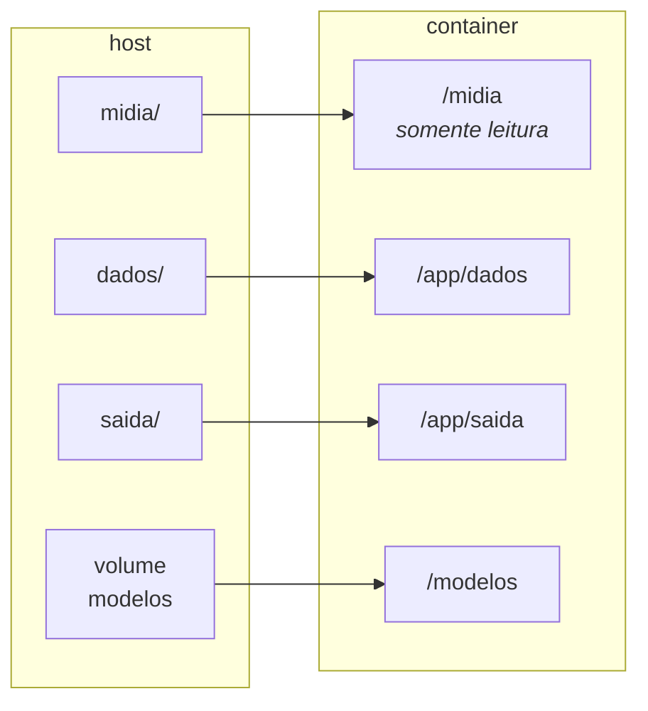

# Rodar em container

Como usar o Transcribefy pelo Docker, sem instalar Python, ffmpeg nem as
dependências na máquina.

Para a instalação direta, veja o [guia de uso](uso.md).
Para a arquitetura interna, [`docs/arquitetura.md`](arquitetura.md).

**Índice**

1. [O que a imagem traz](#1-o-que-a-imagem-traz)
2. [Preparar as pastas](#2-preparar-as-pastas)
3. [Interface web](#3-interface-web)
4. [Linha de comando](#4-linha-de-comando)
5. [Pastas e volumes](#5-pastas-e-volumes)
6. [Onde a transcrição fica](#6-onde-a-transcrição-fica)
7. [Ajustar caminhos e porta](#7-ajustar-caminhos-e-porta)
8. [Modelos de fala](#8-modelos-de-fala)
9. [Sem o compose](#9-sem-o-compose)
10. [Atualizar a imagem](#10-atualizar-a-imagem)
11. [Quando dá errado](#11-quando-dá-errado)

---

## 1. O que a imagem traz

Uma imagem de cerca de 340 MB, baseada em `python:3.12-slim`, com o ffmpeg do
sistema instalado e as dependências nas versões fixas do
[`requirements.txt`](../requirements.txt) — a mesma combinação em que o projeto foi
testado. Não é preciso ter Python na máquina.

O entrypoint é o próprio `transcritor`, então a imagem serve para as duas
interfaces: sem argumentos ela sobe o servidor web; com argumentos ela roda o
comando de linha correspondente.

Continua valendo o que vale fora do container: tudo roda offline, com exceção do
download inicial dos modelos e da tradução opcional.

**Pré-requisito.** Docker Engine ou Docker Desktop. No Windows com WSL2, ative a
integração com a distribuição em **Settings → Resources → WSL integration**, senão o
`docker` não existe dentro do WSL.

---

## 2. Preparar as pastas

O compose monta três pastas do projeto dentro do container. Crie-as antes da
primeira execução — se elas não existirem, o Docker as cria como `root` e você não
conseguirá escrever nelas depois:

```bash
mkdir -p midia dados saida
```

Coloque as gravações em `midia/`. As três pastas são ignoradas pelo Git. Para usar
outros caminhos — uma pasta do Windows, por exemplo —, veja a
[seção 7](#7-ajustar-caminhos-e-porta).

```bash
docker compose build
```

---

## 3. Interface web

```bash
docker compose up -d
```

A página fica em <http://127.0.0.1:8000>. O servidor segue no ar depois de fechar o
terminal — é um serviço, não um comando em primeiro plano — e volta sozinho quando a
máquina reinicia, por causa do `restart: unless-stopped`. O `docker compose down`
desliga de vez; para não subir mais no boot, remova essa linha do compose.

```bash
docker compose ps            # estado e saúde do container
docker compose logs -f       # acompanhar o que está acontecendo
docker compose down          # encerrar
```

O `docker compose ps` mostra `healthy` quando a aplicação está respondendo: há uma
verificação a cada 30 s contra a própria API.

> **Para a gravação completa, prefira a linha de comando.** O envio pelo navegador
> copia o arquivo inteiro para `dados/`. Numa sessão de três horas, são vários GB
> duplicados em disco e um upload demorado. Pela CLI, o vídeo é lido de `midia/`,
> onde ele já está.

---

## 4. Linha de comando

O mesmo serviço roda qualquer comando da CLI. O `run` sobe um container próprio, não
precisa do servidor no ar, e o `--rm` o descarta ao terminar:

```bash
# quais faixas o arquivo tem?
docker compose run --rm transcribefy faixas /midia/gravacao.mp4

# teste de cinco minutos
docker compose run --rm transcribefy transcrever /midia/gravacao.mp4 \
  --inicio 600 --fim 900 -f md -o saida/teste

# a sessão completa, com os nomes reais
docker compose run --rm transcribefy transcrever /midia/gravacao.mp4 \
  --nomes "Ana,Bruno,Caio,Duda,Edu" -o saida/sessao-01
```

Duas regras de caminho, e elas resolvem quase tudo:

- **A entrada vem de `/midia`** — é onde a pasta `midia/` do host aparece dentro do
  container. Um caminho do host, como `~/videos/gravacao.mp4`, não existe lá dentro.
- **A saída usa caminho relativo**, como `-o saida/sessao-01`. O diretório de
  trabalho é `/app`, então isso grava em `/app/saida`, que é a pasta `saida/` do
  host.

Todas as opções são as mesmas da instalação direta:
[guia de uso, seção 5](uso.md#5-todas-as-opções).

> **Num script, use `docker compose run --rm -T`.** Sem o `-T`, o compose tenta
> alocar um terminal e o comando fica pendurado quando não há um. No uso manual,
> pelo terminal, o `-T` é dispensável.

---

## 5. Pastas e volumes



| No host | No container | Para quê |
|---|---|---|
| `midia/` | `/midia` | Gravações de entrada. Montada **somente para leitura**: a aplicação nunca escreve nos seus vídeos. |
| `dados/` | `/app/dados` | Trabalhos enviados pela interface web, um diretório por envio. |
| `saida/` | `/app/saida` | Transcrições geradas pela CLI. |
| volume `modelos` | `/modelos` | Cache dos modelos Vosk. |

O cache dos modelos é um **volume nomeado**, não uma pasta do projeto: ele sobrevive
a `docker compose down` e a reconstruções da imagem, o que evita rebaixar até 1,6 GB
a cada mudança no código. A variável `TRANSCRITOR_MODELOS=/modelos` já vem definida
na imagem.

Para apagá-lo de vez — quando o disco apertar, por exemplo:

```bash
docker compose down -v
```

---

## 6. Onde a transcrição fica

| Como você roda | No container | No host |
|---|---|---|
| `transcrever -o saida/sessao-01` | `/app/saida/sessao-01.*` | `saida/sessao-01.*` |
| Interface web | `/app/dados/trabalhos/<id>/<vídeo>.*` | `dados/trabalhos/<id>/<vídeo>.*` |

O diretório de trabalho do container é `/app`, então um caminho relativo como
`-o saida/sessao-01` cai em `/app/saida` — que é a pasta `saida/` do projeto. É por
isso que o mesmo comando funciona dentro e fora do container.

Pela interface web, cada envio ganha um diretório próprio em `dados/trabalhos/`,
identificado por um código, com **a cópia do vídeo enviado** ao lado das
transcrições. A página de resultado oferece cada arquivo para download, o que
costuma ser o caminho mais curto para tirá-los dali.

> **Sem volume montado, a transcrição fica presa no container.** Um
> `docker run --rm` sem `-v` a descarta junto com o container ao terminar. Com o
> compose isso não acontece: as três pastas estão montadas.

> **A pasta `dados/` só cresce.** Nada apaga os trabalhos antigos, e cada um guarda
> uma cópia do vídeo — vários GB por sessão. De tempos em tempos, limpe o que já foi
> baixado: `rm -rf dados/trabalhos/<id>`.

### Levar os arquivos para o Windows

Quatro caminhos, do mais simples ao mais integrado:

1. **Baixar pela interface web.** O link de download entrega o arquivo ao navegador;
   se ele roda no Windows, cai em `C:\Users\<você>\Downloads`. Não exige
   configuração nenhuma.
2. **Abrir a pasta do WSL pelo Explorer.** Na barra de endereços:
   `\\wsl.localhost\<distro>\home\<usuário>\...\transcricao_audio\saida`. Nada é
   copiado, e os arquivos continuam no disco do Linux, que é o mais rápido.
3. **Gravar direto no disco do Windows**, apontando a pasta de saída para o `/mnt/c`
   no `.env` (próxima seção).
4. **Copiar de um container já encerrado**, quando não havia volume:
   `docker compose cp transcribefy:/app/saida/. ./saida/`.

> **Só a saída no `/mnt/c`.** O disco do Windows visto pelo WSL é bem mais lento que
> o do Linux. Para os arquivos de texto gerados, de poucos MB, isso não se nota. Já o
> **vídeo de entrada** e os WAVs temporários — centenas de MB por hora de gravação —
> deixam a transcrição sensivelmente mais lenta se passarem por ali. Mantenha
> `midia/` no lado Linux.

---

## 7. Ajustar caminhos e porta

Caminhos, porta e dono dos arquivos saem de variáveis de ambiente com valor padrão.
O lugar de mudá-los é um arquivo `.env`, **não** o `docker-compose.yml`: o compose é
versionado e igual para todo mundo, enquanto o `.env` é ignorado pelo Git e guarda o
que é daquela máquina.

```bash
cp .env.exemplo .env
```

| Variável | Padrão | O que faz |
|---|---|---|
| `TRANSCRIBEFY_BIND` | `127.0.0.1:8000` | Onde a interface escuta. Só a porta (`8000`) a expõe para a rede — e não há autenticação na página. |
| `TRANSCRIBEFY_MIDIA` | `./midia` | Pasta com as gravações de entrada. |
| `TRANSCRIBEFY_DADOS` | `./dados` | Trabalhos da interface web. |
| `TRANSCRIBEFY_SAIDA` | `./saida` | Transcrições geradas pela CLI. |
| `TRANSCRIBEFY_UID` / `_GID` | `1000` | Dono dos arquivos gerados. |

Para que as transcrições apareçam direto numa pasta do Windows:

```ini
TRANSCRIBEFY_SAIDA=/mnt/c/Users/<voce>/Documents/sessoes
```

Depois, `docker compose up -d` recria o container com a montagem nova. Um
`docker compose config` mostra como o arquivo ficou depois de substituir as
variáveis — é a forma de conferir antes de subir.

Se precisar de algo que não cabe numa variável — outra montagem, outro comando
padrão —, crie um `docker-compose.override.yml`. O compose o aplica por cima
automaticamente, e ele também é ignorado pelo Git.

---

## 8. Modelos de fala

Os modelos são baixados na primeira vez que são usados, dentro do container, e
ficam no volume. Para tirar essa espera do caminho da primeira transcrição:

```bash
docker compose run --rm transcribefy modelos --baixar pt-grande
docker compose run --rm transcribefy modelos          # o que já está em cache
```

A tabela de apelidos e tamanhos está no
[guia de uso, seção 6](uso.md#6-modelos-de-fala).

---

## 9. Sem o compose

O compose só embrulha o que o `docker run` faria. O equivalente direto:

```bash
docker build -t transcribefy:local .

# interface web
docker run -d --name transcribefy -p 127.0.0.1:8000:8000 \
  -v transcribefy-modelos:/modelos \
  -v "$PWD/midia:/midia:ro" \
  -v "$PWD/dados:/app/dados" \
  -v "$PWD/saida:/app/saida" \
  transcribefy:local

# linha de comando
docker run --rm \
  -v transcribefy-modelos:/modelos \
  -v "$PWD/midia:/midia:ro" \
  -v "$PWD/saida:/app/saida" \
  transcribefy:local faixas /midia/gravacao.mp4
```

O `-p 127.0.0.1:8000:8000` publica a porta só para a própria máquina. Para alcançar
a interface de outro computador da rede, troque por `-p 8000:8000` — e lembre que
não há autenticação nenhuma na página.

---

## 10. Atualizar a imagem

Depois de mudar o código ou as dependências:

```bash
docker compose up -d --build
```

A reconstrução reaproveita as camadas: mexer só nos módulos não reinstala as
dependências, porque o `requirements.txt` é copiado e instalado antes do código. Já
uma alteração no `requirements.txt` refaz a camada de dependências inteira — o que é
justamente o esperado.

O volume de modelos não é afetado por nenhuma reconstrução.

---

## 11. Quando dá errado

### Permissão negada nos arquivos gerados

> `Permission denied` ao escrever em `saida/`, ou arquivos que o host não consegue
> abrir

O container escreve com o UID 1000 — o mesmo do primeiro usuário na maioria das
instalações Linux e do WSL. Confira o seu com `id -u`. Se for diferente, ajuste no
`.env`:

```ini
TRANSCRIBEFY_UID=1001
TRANSCRIBEFY_GID=1001
```

E conserte o que já existe, dos dois lados. No host:
`sudo chown -R $(id -u):$(id -g) dados saida`. No volume dos modelos, que foi criado
com o dono antigo:

```bash
docker compose run --rm --user root --entrypoint chown transcribefy \
  -R $(id -u):$(id -g) /modelos
```

Em pastas do Windows montadas pelo `/mnt/c`, a permissão vem das opções de montagem
do disco, e não do dono do arquivo — normalmente não é preciso ajustar nada. Se
mesmo ali aparecer `Permission denied`, vale o mesmo conserto acima.

### A página não abre

> `http://127.0.0.1:8000` não responde

Verifique se o container está de pé e saudável com `docker compose ps`. Se ele
estiver reiniciando, `docker compose logs` mostra o motivo.

No Windows com WSL2, use o IP da VM em vez do localhost quando o encaminhamento
falhar: `hostname -I` mostra o endereço. Para que a porta responda também nesse IP,
ponha `TRANSCRIBEFY_BIND=8000` no `.env` e suba de novo — mas lembre que a página
passa a aceitar conexões de qualquer um que alcance a máquina, sem autenticação.

### O vídeo não é encontrado

> `Arquivo não encontrado: /home/voce/videos/gravacao.mp4`

O container enxerga só o que foi montado. Copie ou mova a gravação para `midia/` e
use o caminho `/midia/<arquivo>`, ou aponte o `TRANSCRIBEFY_MIDIA` do `.env` para a
pasta onde os vídeos já estão.

### Os modelos são baixados toda vez

Sinal de que o volume não está sendo usado — normalmente por rodar um `docker run`
sem o `-v transcribefy-modelos:/modelos`. Com o compose isso não acontece.

### Porta já em uso

> `port is already allocated`

Outro container ou o `transcritor web` local já ocupam a 8000. Encerre o que estiver
rodando ou publique em outra porta, pelo `.env`:

```ini
TRANSCRIBEFY_BIND=127.0.0.1:8080
```

### Sem espaço em disco no meio da transcrição

As duas faixas são extraídas para WAV num diretório temporário antes do
reconhecimento — cerca de 350 MB por faixa a cada hora de gravação, apagados ao
final. Dentro do container isso vai para o `/tmp` da própria camada de escrita, que
divide espaço com as imagens do Docker. Para mandar esses temporários para um disco
com folga, monte a pasta e aponte o `TMPDIR` no serviço:

```yaml
    environment:
      TMPDIR: /tmp-grande
    volumes:
      - /mnt/disco/tmp:/tmp-grande
```

### Problemas que não são do container

Trilhas invertidas, texto ruim, vozes embaralhadas e afins não têm nada a ver com o
Docker: a solução está no [guia de uso, seção 10](uso.md#10-quando-dá-errado).
