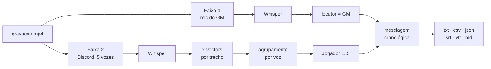

# Guia de uso

Como instalar, iniciar e configurar o Transcribefy.

Para uma visão geral do projeto, veja o [README](../README.md).
Para rodar tudo em container, [`docs/docker.md`](docker.md).
Para a arquitetura interna, [`docs/arquitetura.md`](arquitetura.md).

**Índice**

1. [O que a ferramenta faz](#1-o-que-a-ferramenta-faz)
2. [Instalação](#2-instalação)
3. [Iniciar a aplicação](#3-iniciar-a-aplicação)
4. [A primeira transcrição](#4-a-primeira-transcrição)
5. [Todas as opções](#5-todas-as-opções)
6. [Modelos de fala](#6-modelos-de-fala)
7. [Personalização](#7-personalização)
8. [Arquivos gerados](#8-arquivos-gerados)
9. [Ajuste fino da separação de vozes](#9-ajuste-fino-da-separação-de-vozes)
10. [Quando dá errado](#10-quando-dá-errado)

---

## 1. O que a ferramenta faz

No OBS, o microfone do GM é gravado na trilha 1 e o áudio do Discord com os cinco
jogadores na trilha 2. O Transcribefy lê as duas separadamente e as costura de
volta numa linha do tempo só.

A faixa 1 não precisa de análise: é sempre a mesma pessoa, então cada fala recebe
o rótulo do GM direto. Só a faixa 2 passa pela separação de vozes, que agrupa as
falas por semelhança de timbre.

O reconhecimento é feito pelo Whisper, que decodifica o áudio em janelas de 30 s
levando em conta o que já transcreveu. É de onde vêm a pontuação, as maiúsculas e a
escolha da palavra certa entre duas parecidas — um reconhecedor que olha só o som
imediato erra bem mais nesses três pontos.



O resultado:

```
**[01:12.40] GM:** vocês chegam à porta da cripta, e ela está entreaberta
**[01:18.90] Ana:** eu empurro devagar, tentando não fazer barulho
**[01:24.10] Bruno:** espera, deixa eu checar armadilhas antes
```

---

## 2. Instalação

Só é preciso fazer isto uma vez. O projeto exige **Python 3.12** ou mais novo.

```bash
# se ainda não tiver o projeto na máquina
git clone https://github.com/Vinicius-Nassif/transcribefy.git
cd transcribefy
```

No **Windows 11** há um comando que faz tudo — pule para a
[seção 2.1](#21-windows-11-um-comando-só). No Linux, no macOS e no WSL, siga da
[2.2](#22-ambiente-virtual-linux-macos-e-wsl) em diante.

### 2.1 Windows 11: um comando só

Abra o **PowerShell** na pasta do projeto e rode:

```powershell
.\scripts\instalar-windows.cmd
```

Ele cria o ambiente virtual, instala as dependências, registra o comando
`transcritor` e — se encontrar uma GPU NVIDIA — instala também as bibliotecas
CUDA. No fim, confere a instalação e mostra como usar.

> Use o `.cmd`, e não o `.ps1` diretamente: ele chama o PowerShell com a política
> de execução liberada só para este script, o que evita o erro
> *"execution of scripts is disabled on this system"* numa instalação limpa.
> Também dá para clicar duas vezes no arquivo.

**Não precisa instalar ffmpeg.** A aplicação usa o binário que vem junto com a
dependência `imageio-ffmpeg`.

**Se faltar o Python**, o script diz isso e como resolver:

```powershell
winget install --id Python.Python.3.12 --source winget
```

Feche e reabra o terminal depois de instalar, e rode o script de novo.

#### Opções do instalador

| Opção | O que faz |
|---|---|
| `-Gpu auto` | Padrão. Instala as bibliotecas CUDA se houver GPU NVIDIA. |
| `-Gpu nao` | Pula a CUDA. Economiza 1,4 GB; tudo roda em CPU. |
| `-Gpu sim` | Instala a CUDA mesmo sem detectar a GPU. |
| `-BaixarModelo <apelido>` | Já baixa um modelo (ex.: `rapido`), tirando a espera da primeira transcrição. |
| `-Python <caminho>` | Usa um `python.exe` específico, em vez de procurar sozinho. |
| `-Recriar` | Apaga o `.venv` existente e começa do zero. |

```powershell
.\scripts\instalar-windows.cmd -Gpu nao -BaixarModelo rapido
```

#### Depois de instalar

```powershell
.venv\Scripts\transcritor.exe faixas C:\Users\voce\Videos\gravacao.mp4
.venv\Scripts\transcritor.exe transcrever C:\Users\voce\Videos\gravacao.mp4 -o saida\sessao-01
.venv\Scripts\transcritor.exe web
```

Para digitar só `transcritor`, ative o ambiente antes com
`.venv\Scripts\Activate.ps1`.

> **Na primeira transcrição o Hugging Face pode avisar sobre links simbólicos.**
> É só um aviso: sem o modo de desenvolvedor do Windows ligado, ele copia os
> arquivos do modelo em vez de criar links. Funciona igual, ocupando mais disco.

### 2.2 Ambiente virtual (Linux, macOS e WSL)

Todas as bibliotecas ficam numa pasta `.venv/` dentro do projeto, isolada do Python
do sistema. Com o [uv](https://docs.astral.sh/uv/):

```bash
uv venv --python 3.12
```

Sem o uv, o módulo `venv` da biblioteca padrão faz a mesma coisa:

```bash
python3.12 -m venv .venv
```

Não é obrigatório ativar o ambiente: chamar `.venv/bin/transcritor` já usa o Python
e as bibliotecas de dentro dele. Se preferir digitar só `transcritor`:

```bash
source .venv/bin/activate   # para sair: deactivate
```

Se algo ficar inconsistente, apagar a pasta e recriá-la é seguro — nada além das
dependências mora nela: `rm -rf .venv` e repita os passos.

### 2.3 Dependências

O [`requirements.txt`](../requirements.txt) lista **todas as versões fixas**, as
mesmas em que o projeto foi testado. É a forma recomendada de instalar: uma
atualização futura de qualquer biblioteca não muda o que entra no ambiente.

```bash
uv pip install -r requirements.txt
uv pip install -e . --no-deps
```

Se o ambiente foi criado com `python3.12 -m venv`, ele já traz o `pip`, e os mesmos
dois passos ficam assim:

```bash
.venv/bin/pip install -r requirements.txt
.venv/bin/pip install -e . --no-deps
```

> Ambientes criados com `uv venv` **não** incluem o `pip` — use o `uv pip` neles.

O segundo comando registra o próprio projeto no ambiente — é ele que cria o
executável `.venv/bin/transcritor`. O `--no-deps` evita que o instalador resolva de
novo as faixas abertas do `pyproject.toml` e acabe subindo uma versão já fixada.

Para acompanhar sempre as versões mais novas, em vez dos dois comandos acima:

```bash
uv pip install -e .
```

Aí valem as faixas `>=` do `pyproject.toml`, e o ambiente pode variar de uma
instalação para outra. O `pytest`, usado pelos testes, já vem no `requirements.txt`.

> **Atualizar as versões fixas.** Depois de confirmar que tudo funciona com as
> bibliotecas novas, regenere o arquivo a partir do ambiente:
>
> ```bash
> uv pip freeze | grep -v '^-e ' > requirements.txt
> ```
>
> O `grep` descarta a linha do próprio projeto, que não é uma dependência.

### 2.3.1 GPU NVIDIA (opcional, mas vale muito)

O Whisper roda em CPU sem nenhum ajuste. Com uma GPU NVIDIA ele fica cerca de dez
vezes mais rápido, e aí o modelo mais preciso deixa de ser caro:

```bash
uv pip install -r requirements-gpu.txt
```

São as bibliotecas CUDA (~1,4 GB) que o reconhecedor procura em tempo de execução.
O driver continua vindo do sistema — no WSL2, do driver do Windows; não instale
driver NVIDIA dentro do WSL.

Para conferir o que a aplicação vai usar:

```bash
.venv/bin/python -c "from transcritor import motor_whisper; print(motor_whisper.escolher_dispositivo())"
```

`('cuda', 'int8_float16')` é GPU; `('cpu', 'int8')` é CPU. A escolha é automática e
cai para a CPU sozinha quando não há GPU utilizável — `--dispositivo cpu` força, e
`--dispositivo cuda` falha com uma mensagem em vez de cair calado.

### 2.4 E o ffmpeg?

A aplicação precisa do ffmpeg para separar as trilhas. Se não houver um instalado
no sistema, ela usa automaticamente o binário que vem junto com a dependência
`imageio-ffmpeg` — ou seja, **funciona sem nenhuma instalação extra**. Para ter o
ffmpeg completo do sistema, que é mais rápido em arquivos grandes:

```bash
sudo apt install ffmpeg
```

> **Os modelos de reconhecimento não vêm no repositório.** São baixados sozinhos na
> primeira transcrição e ficam em cache — a primeira execução demora alguns minutos
> a mais por causa disso.

### 2.5 Ou nada disso: container

Se preferir não instalar Python, ffmpeg nem as dependências na máquina, a aplicação
roda igual dentro de um container, com as duas interfaces:

```bash
mkdir -p midia dados saida
docker compose up -d
```

O guia completo — volumes, caminhos dentro do container e permissões — está em
[`docs/docker.md`](docker.md). O restante deste documento vale para as duas formas
de instalação; só os caminhos dos arquivos mudam.

---

## 3. Iniciar a aplicação

Há uma interface web, para enviar o vídeo pelo navegador, e uma interface de linha
de comando. Elas fazem exatamente a mesma coisa; a diferença está em como o arquivo
chega até a aplicação.

### Windows 11: um comando só

```powershell
.\scripts\iniciar-windows.cmd
```

Sobe tudo de uma vez e deixa a aplicação pronta para uso:

1. **Confere o ambiente** e mostra onde o reconhecimento vai rodar (GPU ou CPU),
   se o ffmpeg está disponível e quais modelos já estão em cache. Se o ambiente
   ainda não existir, ele chama o instalador sozinho.
2. **Baixa o modelo de fala em paralelo**, quando nenhum está em cache. O download
   é o gargalo da primeira vez, e não há motivo para segurar a interface enquanto
   ele acontece — o progresso vai para `dados\download-modelo.log`.
3. **Sobe o servidor** e espera ele começar a responder de verdade, em vez de
   apostar num tempo fixo.
4. **Abre o navegador** na interface assim que ela responde.

O servidor fica em primeiro plano; `Ctrl+C` encerra tudo, inclusive o download.

Se a porta já estiver com o Transcribefy no ar, o script não sobe um segundo
servidor: ele só abre o navegador no que já está rodando.

| Opção | O que faz |
|---|---|
| `-Porta 8080` | Troca a porta. Padrão 8000. |
| `-Endereco 0.0.0.0` | Aceita conexões de outros computadores da rede. A página **não tem autenticação**. |
| `-BaixarModelo <apelido>` | Baixa esse modelo em paralelo, mesmo que já haja outro em cache. |
| `-SemBaixar` | Não baixa modelo nenhum. |
| `-SemNavegador` | Não abre o navegador. |

```powershell
.\scripts\iniciar-windows.cmd -Porta 8080 -BaixarModelo rapido
```

> **Para a gravação inteira, prefira a linha de comando** — vale no Windows como
> em qualquer outro sistema, pelo motivo explicado logo abaixo.

### Interface web

```bash
.venv/bin/transcritor web --host 0.0.0.0
```

Abra <http://127.0.0.1:8000> no navegador. O servidor roda enquanto o comando
estiver ativo; `Ctrl+C` encerra. Para trocar a porta: `--porta 8080`.

> **Por que `--host 0.0.0.0`?** Se você roda o projeto no WSL2 e abre o navegador no
> Windows, ligar em `0.0.0.0` faz a aplicação responder tanto pelo `127.0.0.1`
> quanto pelo IP da máquina virtual, o que evita o caso em que o encaminhamento de
> localhost do WSL não funciona. `hostname -I` mostra o IP da VM.

### Linha de comando

```bash
.venv/bin/transcritor transcrever gravacao.mp4 -o saida/sessao-01
```

> **Para a gravação completa, prefira a linha de comando.** A interface web copia o
> arquivo inteiro para `dados/trabalhos/` durante o envio. Numa sessão de três
> horas, isso significa vários GB duplicados em disco e um upload demorado pelo
> navegador. A CLI lê o arquivo onde ele já está.

Se preferir ativar a venv em vez de chamar `.venv/bin/` a cada comando, rode
`source .venv/bin/activate` e depois use só `transcritor`.

---

## 4. A primeira transcrição

Uma sessão de três horas leva de uma a três horas para ser transcrita. Não descubra
no fim que as trilhas estavam trocadas — siga esta ordem.

### 4.1 Confira as faixas

Leva um segundo e mostra o que a aplicação enxerga no arquivo:

```bash
.venv/bin/transcritor faixas gravacao.mp4
```

```
Duração: 187.4 min
2 faixa(s) de áudio:
  Faixa 1 - Mic do GM - aac (LC), 48000 Hz, stereo
  Faixa 2 - Discord - aac (LC), 48000 Hz, stereo
```

Se a faixa 1 não for o microfone do GM, inverta com `--faixa-gm 2 --faixa-grupo 1`.

### 4.2 Transcreva cinco minutos

Calibre os ajustes num trecho curto antes de gastar horas. O `-f md` gera só o
Markdown, que é o formato mais fácil de ler na tela:

```bash
.venv/bin/transcritor transcrever gravacao.mp4 \
  --inicio 600 --fim 900 \
  -f md -o saida/teste
```

Os carimbos de tempo continuam na escala do vídeo original, então `--inicio 600`
produz falas marcadas a partir de `10:00` — não de `00:00`.

### 4.3 Avalie o resultado

Abra `saida/teste.md` e olhe duas coisas separadamente:

- **O texto está compreensível?** Se os nomes próprios e o jargão da mesa saem
  errados, é para isso que serve o `--contexto` (veja a
  [seção 7](#contexto-da-mesa)). Se o texto inteiro está ruim, confira se está no
  modelo `preciso` e se a trilha não está com o áudio muito baixo.
- **Os jogadores estão bem separados?** Se as falas estão trocando de dono sem
  sentido, confira se `-n` bate com o número real de vozes na faixa 2.

### 4.4 Rode a sessão inteira

Com os nomes reais, na ordem em que cada um fala pela primeira vez:

```bash
.venv/bin/transcritor transcrever gravacao.mp4 \
  --nomes "Ana,Bruno,Caio,Duda,Edu" \
  --contexto "Campanha de Ravenloft. Strahd von Zarovich, Barovia, Ireena Kolyana." \
  -o saida/sessao-01
```

---

## 5. Todas as opções

Valem para `transcritor transcrever`. A interface web expõe as mesmas opções como
campos do formulário.

| Opção | Padrão | O que faz |
|---|---|---|
| `-o, --saida` | `saida/<vídeo>` | Caminho base dos arquivos, *sem* extensão. Cada formato vira um arquivo. |
| `-m, --modelo` | `preciso` | Apelido da [tabela de modelos](#6-modelos-de-fala), um tamanho do Whisper (`medium`), ou o caminho de um modelo baixado à mão. |
| `--faixa-gm` | `1` | Qual trilha tem o microfone do GM. Contagem a partir de 1. |
| `--faixa-grupo` | `2` | Qual trilha tem os jogadores. |
| `--nome-gm` | `GM` | Rótulo de todas as falas da faixa 1. |
| `-n, --jogadores` | `5` | Quantas vozes existem na faixa 2. Use `auto` para estimar — menos confiável. |
| `--nomes` | — | Nomes separados por vírgula, na ordem da primeira fala de cada um. |
| `-f, --formatos` | todos | Subconjunto de `txt,csv,json,srt,vtt,md`. |
| `--idioma` | `pt` | Idioma do áudio; `auto` deixa o modelo detectar. Também é o idioma de origem da tradução. |
| `--contexto` | — | Nomes, lugares e jargão da mesa, em texto corrido. É o ajuste que mais reduz erro em nome próprio. |
| `--dispositivo` | `auto` | `auto`, `cuda` ou `cpu`. Onde o Whisper roda. |
| `--traduzir` | desligado | Gera também a versão traduzida, ex.: `en`. Única etapa que usa a internet. |
| `--inicio` | `0` | Segundo em que a transcrição começa. |
| `--fim` | fim do vídeo | Segundo em que termina. |
| `--deslocamento` | `0` | Move a faixa 2 no tempo, em segundos, para corrigir dessincronia. |
| `--sem-juntar` | desligado | Mantém cada trecho reconhecido numa linha própria, sem agrupar falas seguidas. |

### Os outros comandos

| Comando | Para quê |
|---|---|
| `transcritor faixas <arquivo>` | Lista as trilhas de áudio e a duração. |
| `transcritor modelos` | Mostra os modelos disponíveis e quais já estão em cache. |
| `transcritor modelos --baixar preciso` | Baixa um modelo antes de precisar dele. |
| `transcritor web` | Sobe a interface no navegador. |
| `transcritor transcrever <arquivo>` | Transcreve. |

---

## 6. Modelos de fala

A escolha do modelo é o que mais afeta a qualidade do texto — e o tempo de
processamento. Cada um é baixado na primeira vez que é usado.

| Apelido | Tamanho | Motor | Quando usar |
|---|---|---|---|
| `preciso` | 3,1 GB | Whisper large-v3 | **Padrão.** A melhor transcrição. Confortável com GPU; em CPU, deixe rodando. |
| `rapido` | 1,6 GB | Whisper large-v3-turbo | Quase a mesma precisão, várias vezes mais rápido. Boa escolha em CPU. |
| `leve` | 490 MB | Whisper small | Máquina modesta. Ainda pontua, mas erra mais nome próprio. |
| `vosk-pt` | 31 MB | Vosk | Só se o resto não couber. Sem pontuação e com muito mais erros. |
| `vosk-pt-grande` | 1,6 GB | Vosk | Vosk mais preciso, ainda sem pontuação. |
| `locutor` | 13 MB | Vosk | Separação de vozes. Baixado sempre, automaticamente, qualquer que seja o motor. |

Os modelos Whisper são multilíngues: para uma mesa em inglês, basta `--idioma en`
(ou `--idioma auto`) — não há um modelo separado por idioma.

Qualquer tamanho conhecido do Whisper também vale direto, sem estar na tabela:
`-m medium`, `-m distil-large-v3`.

> **Por que não o Vosk por padrão?** Ele decide cada palavra olhando pouco além do
> som imediato: sai sem pontuação, tudo em minúsculas, e troca com frequência uma
> palavra por outra parecida. Em conversa espontânea de mesa, com gente falando por
> cima, o texto vira algo difícil de reler. Ele fica como alternativa leve e
> offline; a qualidade está nos modelos Whisper.

Os arquivos ficam em `~/.cache/transcritor-rpg/modelos`. Para guardá-los em outro
lugar — um disco maior, por exemplo — defina a variável de ambiente:

```bash
export TRANSCRITOR_MODELOS=/mnt/dados/modelos
```

---

## 7. Personalização

### Contexto da mesa

É o ajuste com melhor relação entre esforço e resultado. Antes de transcrever, o
modelo recebe um texto curto com os nomes e os termos que vão aparecer; ele passa a
preferir essas palavras quando o áudio é ambíguo.

```bash
.venv/bin/transcritor transcrever gravacao.mp4 \
  --contexto "Campanha de Ravenloft. Strahd von Zarovich, Barovia, Ireena Kolyana, Vallaki. Termos: iniciativa, teste de resistência, ponto de inspiração."
```

Na interface web é o campo **Contexto da mesa**.

Os nomes do GM e dos jogadores entram sozinhos, sem precisar repeti-los: o
`--nome-gm` e o `--nomes` já são incluídos antes do seu texto.

O que vale a pena citar, em ordem de retorno:

1. **Nomes próprios** — personagens, NPCs, cidades, divindades, artefatos. É onde o
   reconhecimento mais erra, porque troca o nome pela palavra comum mais parecida.
2. **Jargão do sistema** — as expressões que a mesa repete o tempo todo.
3. **O assunto da sessão** — uma frase dizendo do que se trata.

Escreva em texto corrido, como uma frase, e não como uma lista de palavras soltas —
é assim que o modelo espera receber. Umas poucas linhas bastam; textos muito longos
são cortados e não ajudam mais que isso.

> **É uma dica, não uma regra.** O contexto enviesa a escolha das palavras, não a
> obriga. E vale só para os modelos Whisper: com `-m vosk-pt` a opção é ignorada.

### Nomes de quem fala

Sem configuração, o resultado usa `GM` e `Jogador 1` a `Jogador 5`. O `--nomes`
substitui os jogadores **na ordem em que cada voz aparece pela primeira vez** na
gravação — não na ordem em que eles sentam à mesa.

```bash
.venv/bin/transcritor transcrever gravacao.mp4 \
  --nome-gm "Mestre" \
  --nomes "Ana,Bruno,Caio,Duda,Edu"
```

Na prática, é mais fácil rodar uma vez sem nomes, abrir o Markdown, ver quem é
`Jogador 1`, `Jogador 2` e assim por diante, e só então rodar de novo com os nomes
na ordem certa. Se você passar menos nomes que o número de vozes, os que sobrarem
continuam numerados.

### Trilhas invertidas

A ordem das trilhas depende de como o OBS foi configurado. Se o
`transcritor faixas` mostrar o Discord na trilha 1:

```bash
.venv/bin/transcritor transcrever gravacao.mp4 --faixa-gm 2 --faixa-grupo 1
```

### Escolher os formatos

Por padrão são gerados todos. Para legendas de um vídeo de recap, só o `srt`
interessa:

```bash
.venv/bin/transcritor transcrever gravacao.mp4 -f srt
```

### Corrigir dessincronia entre as trilhas

Se as falas dos jogadores aparecem sistematicamente adiantadas ou atrasadas em
relação às do GM, desloque a faixa 2. Valores negativos a adiantam:

```bash
.venv/bin/transcritor transcrever gravacao.mp4 --deslocamento 1.5
```

### Uma linha por trecho

Falas seguidas do mesmo locutor com menos de 2 segundos de silêncio entre elas
viram um parágrafo só. Para preservar cada trecho reconhecido separadamente — útil
quando o destino é legenda —, use `--sem-juntar`.

### Tradução

O `--traduzir en` gera, além dos arquivos normais, uma segunda leva com o sufixo do
idioma. Linhas que a tradução não conseguir cobrir voltam no idioma original, e o
número delas é informado ao final.

> Esta é a **única** etapa que sai da sua máquina: o texto é enviado ao Google
> Tradutor. Todo o resto — extração de áudio, reconhecimento e separação de vozes —
> roda offline.

---

## 8. Arquivos gerados

Um `-o saida/sessao-01` produz `saida/sessao-01.md`, `saida/sessao-01.srt` e assim
por diante.

| Arquivo | Para quê |
|---|---|
| `.md` | Leitura na tela. Carimbo de tempo, nome e fala, com espaço entre os blocos. |
| `.txt` | Texto corrido com o tempo no começo de cada linha. |
| `.srt` `.vtt` | Legendas, para montar um vídeo de recap da sessão. |
| `.csv` | Planilha, com uma coluna de tempo e uma de texto. |
| `.json` | Formato simples do pytranscript: listas de tempos e textos. |
| `.detalhado.json` | O mais completo. Início, fim, faixa de origem, locutor e marca de simultaneidade de cada fala. |

O `.detalhado.json` é o formato para pós-processamento — gerar um resumo, contar
quanto cada jogador falou, cruzar com as rolagens de dado:

```json
{
  "locutores": ["Ana", "Bruno", "GM"],
  "total_falas": 1482,
  "total_sobrepostas": 391,
  "duracao": 11245.6,
  "falas": [
    { "inicio": 72.4, "fim": 79.1, "faixa": 1,
      "locutor": "GM", "sobreposta": true,
      "texto": "vocês chegam à porta da cripta" }
  ]
}
```

As legendas `.srt` e `.vtt` usam o tempo final real de cada fala, e não uma
estimativa fixa — elas acompanham a duração da frase.

### Falas simultâneas

Numa mesa animada as pessoas se interrompem e respondem por cima. **Nenhuma fala
é descartada por coincidir no tempo com a de outra pessoa**, em nenhum formato: as
duas faixas são transcritas separadamente e entram na mesma linha do tempo, cada
uma com o seu início e o seu fim reais.

Uma consequência a conhecer: a lista é ordenada pelo **início** de cada fala e não
mostra onde ela termina. Um aparte no meio de um monólogo aparece depois dele.

```
**[00:03.70] GM:** Aí, então, meu GPT ele voltou, só que eu tô tendo que usar…
**[00:16.09] Nassif:** bota
```

O `bota` do Nassif é aos 16 s — dentro da fala do GM, que só termina aos 26,8 s.
Quem separa esse caso de uma sequência comum é o campo `sobreposta` do
`.detalhado.json`, e o `total_sobrepostas` diz quantas foram no total.

Nas legendas, as duas falas aparecem com os tempos reais e **os blocos se
sobrepõem** — é válido em SRT e em VTT, e a maioria dos reprodutores empilha as
linhas. Um bloco de legenda nunca é encurtado porque o seguinte começa antes: isso
apagaria a interrupção da linha do tempo.

> **O limite real.** Duas pessoas falando ao mesmo tempo **na mesma faixa** — dois
> jogadores no Discord — chegam misturadas num áudio mono só. O reconhecimento
> transcreve a voz dominante e a outra se perde, e a separação de vozes ainda
> recebe um timbre misturado e costuma errar o dono da fala. Nenhum ajuste do
> projeto resolve isso; resolveria gravar cada jogador numa faixa própria.

### Onde eles ficam

| Interface | Caminho |
|---|---|
| Linha de comando | O que você passou em `-o`. Sem essa opção, `saida/<nome-do-vídeo>`, **relativo à pasta de onde o comando foi chamado**. |
| Web | `dados/trabalhos/<código>/`, um diretório por envio, com a cópia do vídeo enviado ao lado das transcrições. |

A página de resultado oferece cada arquivo para download, o que costuma ser a forma
mais direta de tirá-los dali — principalmente se o navegador está noutra máquina.

> **A pasta `dados/` só cresce.** Nada apaga os trabalhos antigos, e cada um guarda
> uma cópia do vídeo — vários GB por sessão. Depois de baixar o que interessa,
> `rm -rf dados/trabalhos/<código>`.

Rodando em container, esses mesmos caminhos ficam dentro dele e aparecem no host
conforme os volumes montados:
[`docs/docker.md`, seção 6](docker.md#6-onde-a-transcrição-fica).

### Salvar no Windows, a partir do WSL

O disco do Windows aparece em `/mnt/c`, então basta apontar a saída para lá:

```bash
.venv/bin/transcritor transcrever gravacao.mp4 \
  -o /mnt/c/Users/<voce>/Documents/sessoes/sessao-01
```

O caminho inverso costuma ser ainda mais prático: o Explorer do Windows abre a pasta
do projeto sem copiar nada, pelo endereço
`\\wsl.localhost\<distro>\home\<usuário>\...\transcricao_audio\saida`.

> **Deixe só a saída no `/mnt/c`.** O acesso ao disco do Windows pelo WSL é bem mais
> lento que ao disco do Linux. Nos arquivos de texto gerados, de poucos MB, isso não
> se nota; já o **vídeo de entrada** e os WAVs temporários — centenas de MB por hora
> de gravação — deixam a transcrição sensivelmente mais lenta se ficarem ali.

---

## 9. Ajuste fino da separação de vozes

As constantes que governam o agrupamento estão no topo de
[`transcritor/diarizacao.py`](../transcritor/diarizacao.py) e
[`transcritor/mesclagem.py`](../transcritor/mesclagem.py). Mexer nelas é a forma de
adaptar a ferramenta ao jeito da sua mesa.

| Constante | Padrão | Efeito |
|---|---|---|
| `MIN_FRAMES_CONFIAVEL` | `40` | Tamanho mínimo de uma fala para ela ajudar a formar os grupos. Abaixar inclui respostas curtas, mas com vetores mais ruidosos. |
| `LIMIAR_AUTO` | `0.55` | Distância de corte no modo `auto`. Menor separa mais vozes; maior agrupa mais. |
| `MARGEM_SUAVIZACAO` | `0.05` | O quanto a voz precisa discordar do contexto para uma fala curta não ser absorvida pelos vizinhos. |
| `JANELA_SUAVIZACAO` | `1.5` s | Duração máxima de uma fala candidata a ser corrigida pelo contexto. |
| `PAUSA_MAXIMA` | `2.0` s | Silêncio máximo para duas falas seguidas do mesmo locutor virarem um parágrafo só. |

### O que esperar

Em trechos de um a dois segundos, a distância entre vozes fica em torno de **0,40
para o mesmo locutor** e **0,74 para locutores diferentes**. As duas distribuições
se sobrepõem, então parte das falas curtas é atribuída errado. Três fatores
explicam quase todos os erros:

- **Fala sobreposta** — duas pessoas ao mesmo tempo produzem um timbre misturado,
  que não corresponde a nenhuma das duas.
- **Respostas de uma ou duas palavras** — curtas demais para um vetor de voz
  estável.
- **Vozes parecidas com o mesmo headset** — microfones diferentes entre os
  jogadores, por outro lado, ajudam bastante.

> **Conte com revisão manual.** A separação de vozes é uma estimativa, não um dado.
> Ela economiza a maior parte do trabalho de identificar quem falou, mas não
> substitui uma passada de olho — sobretudo em cenas de discussão, onde todo mundo
> fala junto.

---

## 10. Quando dá errado

### A página não abre

> `http://127.0.0.1:8000` não responde

Quase sempre é o servidor que não está rodando — ele só existe enquanto o comando
`transcritor web` estiver ativo num terminal. Para confirmar quem está escutando na
porta:

```bash
ss -ltn | grep 8000
```

Sem resposta, suba o servidor. Se ele estiver rodando e ainda assim o navegador não
abrir, use o IP do WSL em vez do localhost: `hostname -I` mostra o endereço, e a
página fica em `http://<ip>:8000`. Esse IP muda a cada reinício do WSL.

### Só uma trilha de áudio

> `O vídeo tem 1 faixa(s) de áudio; são necessárias 2.`

A gravação saiu com tudo misturado, e não há como separar as vozes depois. O ajuste
é no OBS, antes de gravar: em **Configurações → Saída → Gravação**, marque as
trilhas 1 e 2. Depois, no mixer, use **Propriedades avançadas de áudio** para mandar
o microfone do GM só para a trilha 1 e o Discord só para a trilha 2.

Para sessões longas, o **MKV é mais seguro que o MP4**: uma queda de energia não
corrompe o arquivo, e ele ainda preserva os nomes das trilhas, que aparecem no
`transcritor faixas`.

### Porta já em uso

> `address already in use`

Já existe um servidor rodando. Encerre com `pkill -f "transcritor web"` ou suba o
novo em outra porta com `--porta 8080`.

### O texto saiu ruim

> palavras trocadas, frases sem sentido

Nesta ordem:

1. **Confira o modelo.** Sem `-m`, o padrão já é o `preciso`. Se o comando veio de
   um script antigo com `-m pt-pequeno`, é o Vosk que está rodando — sem pontuação e
   com muito mais erro. Tire a opção.
2. **Use o `--contexto`.** Nome próprio e jargão da mesa são o grosso dos erros que
   sobram, e é isso que os corrige. Veja a [seção 7](#contexto-da-mesa).
3. **Olhe o áudio.** Trilha muito baixa, microfone longe ou muita gente falando por
   cima limitam qualquer modelo. Ouça o trecho que saiu pior antes de culpar a
   transcrição.

> **Frases repetidas ou legendas de YouTube no meio do nada?** Em trechos longos de
> silêncio o Whisper às vezes inventa um bordão do tipo "Legendas pela comunidade
> Amara.org". Os mais comuns são descartados automaticamente; se aparecer um novo,
> ele pode ser incluído em `motor_whisper.ALUCINACOES`.

### Os jogadores estão embaralhados

> falas trocando de dono sem sentido

Confira primeiro se o `-n` bate com o número real de vozes na faixa 2 — informar o
número exato funciona bem melhor que `auto`. Se ainda assim ficar confuso, veja o
[ajuste fino](#9-ajuste-fino-da-separação-de-vozes): a mesa pode se beneficiar de um
`MIN_FRAMES_CONFIAVEL` diferente.

### A primeira execução está parada

> `Modelo 'preciso' ausente (~3090 MB). Baixando...`

É o download do modelo, que acontece uma única vez. Para tirar essa espera do
caminho, baixe antes com `transcritor modelos --baixar preciso`. O
`transcritor modelos` marca com `*` o que já está em cache.
