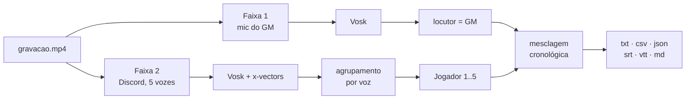

# Guia de uso

Como instalar, iniciar e configurar o Transcribefy.

Para uma visão geral do projeto, veja o [README](../README.md).
Para a arquitetura interna, [`docs/arquitetura.md`](arquitetura.md).

**Índice**

1. [O que a ferramenta faz](#1-o-que-a-ferramenta-faz)
2. [Instalação](#2-instalação)
3. [Iniciar a aplicação](#3-iniciar-a-aplicação)
4. [A primeira transcrição](#4-a-primeira-transcrição)
5. [Todas as opções](#5-todas-as-opções)
6. [Modelos de fala](#6-modelos-de-fala)
7. [Personalização](#7-personalização)
8. [Arquivos gerados](#8-arquivos-gerados)
9. [Ajuste fino da separação de vozes](#9-ajuste-fino-da-separação-de-vozes)
10. [Quando dá errado](#10-quando-dá-errado)

---

## 1. O que a ferramenta faz

No OBS, o microfone do GM é gravado na trilha 1 e o áudio do Discord com os cinco
jogadores na trilha 2. O Transcribefy lê as duas separadamente e as costura de
volta numa linha do tempo só.

A faixa 1 não precisa de análise: é sempre a mesma pessoa, então cada fala recebe
o rótulo do GM direto. Só a faixa 2 passa pela separação de vozes, que agrupa as
falas por semelhança de timbre.



O resultado:

```
**[01:12.40] GM:** vocês chegam à porta da cripta, e ela está entreaberta
**[01:18.90] Ana:** eu empurro devagar, tentando não fazer barulho
**[01:24.10] Bruno:** espera, deixa eu checar armadilhas antes
```

---

## 2. Instalação

Só é preciso fazer isto uma vez. O projeto exige **Python 3.12** ou mais novo.

```bash
# se ainda não tiver o projeto na máquina
git clone https://github.com/Vinicius-Nassif/transcribefy.git
cd transcribefy

# ambiente virtual e dependências
uv venv --python 3.12
uv pip install -e .
```

### E o ffmpeg?

A aplicação precisa do ffmpeg para separar as trilhas. Se não houver um instalado
no sistema, ela usa automaticamente o binário que vem junto com a dependência
`imageio-ffmpeg` — ou seja, **funciona sem nenhuma instalação extra**. Para ter o
ffmpeg completo do sistema, que é mais rápido em arquivos grandes:

```bash
sudo apt install ffmpeg
```

> **Os modelos de reconhecimento não vêm no repositório.** São baixados sozinhos na
> primeira transcrição e ficam em cache — a primeira execução demora alguns minutos
> a mais por causa disso.

---

## 3. Iniciar a aplicação

Há uma interface web, para enviar o vídeo pelo navegador, e uma interface de linha
de comando. Elas fazem exatamente a mesma coisa; a diferença está em como o arquivo
chega até a aplicação.

### Interface web

```bash
.venv/bin/transcritor web --host 0.0.0.0
```

Abra <http://127.0.0.1:8000> no navegador. O servidor roda enquanto o comando
estiver ativo; `Ctrl+C` encerra. Para trocar a porta: `--porta 8080`.

> **Por que `--host 0.0.0.0`?** Se você roda o projeto no WSL2 e abre o navegador no
> Windows, ligar em `0.0.0.0` faz a aplicação responder tanto pelo `127.0.0.1`
> quanto pelo IP da máquina virtual, o que evita o caso em que o encaminhamento de
> localhost do WSL não funciona. `hostname -I` mostra o IP da VM.

### Linha de comando

```bash
.venv/bin/transcritor transcrever gravacao.mp4 -o saida/sessao-01
```

> **Para a gravação completa, prefira a linha de comando.** A interface web copia o
> arquivo inteiro para `dados/trabalhos/` durante o envio. Numa sessão de três
> horas, isso significa vários GB duplicados em disco e um upload demorado pelo
> navegador. A CLI lê o arquivo onde ele já está.

Se preferir ativar a venv em vez de chamar `.venv/bin/` a cada comando, rode
`source .venv/bin/activate` e depois use só `transcritor`.

---

## 4. A primeira transcrição

Uma sessão de três horas leva de uma a três horas para ser transcrita. Não descubra
no fim que as trilhas estavam trocadas — siga esta ordem.

### 4.1 Confira as faixas

Leva um segundo e mostra o que a aplicação enxerga no arquivo:

```bash
.venv/bin/transcritor faixas gravacao.mp4
```

```
Duração: 187.4 min
2 faixa(s) de áudio:
  Faixa 1 - Mic do GM - aac (LC), 48000 Hz, stereo
  Faixa 2 - Discord - aac (LC), 48000 Hz, stereo
```

Se a faixa 1 não for o microfone do GM, inverta com `--faixa-gm 2 --faixa-grupo 1`.

### 4.2 Transcreva cinco minutos

Calibre os ajustes num trecho curto antes de gastar horas. O `-f md` gera só o
Markdown, que é o formato mais fácil de ler na tela:

```bash
.venv/bin/transcritor transcrever gravacao.mp4 \
  --inicio 600 --fim 900 \
  -f md -o saida/teste
```

Os carimbos de tempo continuam na escala do vídeo original, então `--inicio 600`
produz falas marcadas a partir de `10:00` — não de `00:00`.

### 4.3 Avalie o resultado

Abra `saida/teste.md` e olhe duas coisas separadamente:

- **O texto está compreensível?** Se não, troque para o modelo grande com
  `-m pt-grande`.
- **Os jogadores estão bem separados?** Se as falas estão trocando de dono sem
  sentido, confira se `-n` bate com o número real de vozes na faixa 2.

### 4.4 Rode a sessão inteira

Com os nomes reais, na ordem em que cada um fala pela primeira vez:

```bash
.venv/bin/transcritor transcrever gravacao.mp4 \
  --nomes "Ana,Bruno,Caio,Duda,Edu" \
  -o saida/sessao-01
```

---

## 5. Todas as opções

Valem para `transcritor transcrever`. A interface web expõe as mesmas opções como
campos do formulário.

| Opção | Padrão | O que faz |
|---|---|---|
| `-o, --saida` | `saida/<vídeo>` | Caminho base dos arquivos, *sem* extensão. Cada formato vira um arquivo. |
| `-m, --modelo` | `pt-pequeno` | Apelido da [tabela de modelos](#6-modelos-de-fala), ou o caminho de um modelo Vosk baixado à mão. |
| `--faixa-gm` | `1` | Qual trilha tem o microfone do GM. Contagem a partir de 1. |
| `--faixa-grupo` | `2` | Qual trilha tem os jogadores. |
| `--nome-gm` | `GM` | Rótulo de todas as falas da faixa 1. |
| `-n, --jogadores` | `5` | Quantas vozes existem na faixa 2. Use `auto` para estimar — menos confiável. |
| `--nomes` | — | Nomes separados por vírgula, na ordem da primeira fala de cada um. |
| `-f, --formatos` | todos | Subconjunto de `txt,csv,json,srt,vtt,md`. |
| `--idioma` | `pt` | Idioma de origem. Usado pela tradução. |
| `--traduzir` | desligado | Gera também a versão traduzida, ex.: `en`. Única etapa que usa a internet. |
| `--inicio` | `0` | Segundo em que a transcrição começa. |
| `--fim` | fim do vídeo | Segundo em que termina. |
| `--deslocamento` | `0` | Move a faixa 2 no tempo, em segundos, para corrigir dessincronia. |
| `--sem-juntar` | desligado | Mantém cada trecho reconhecido numa linha própria, sem agrupar falas seguidas. |

### Os outros comandos

| Comando | Para quê |
|---|---|
| `transcritor faixas <arquivo>` | Lista as trilhas de áudio e a duração. |
| `transcritor modelos` | Mostra os modelos disponíveis e quais já estão em cache. |
| `transcritor modelos --baixar pt-grande` | Baixa um modelo antes de precisar dele. |
| `transcritor web` | Sobe a interface no navegador. |
| `transcritor transcrever <arquivo>` | Transcreve. |

---

## 6. Modelos de fala

A escolha do modelo é o que mais afeta a qualidade do texto — e o tempo de
processamento. Cada um é baixado na primeira vez que é usado.

| Apelido | Tamanho | Quando usar |
|---|---|---|
| `pt-pequeno` | 31 MB | Padrão. Rápido, bom para calibrar e para uma leitura geral da sessão. |
| `pt-grande` | 1,6 GB | Bem mais preciso e bem mais lento. Vale para a transcrição definitiva. |
| `en-pequeno` | 40 MB | Mesa em inglês. |
| `en-grande` | 1,8 GB | Mesa em inglês, versão precisa. |
| `locutor` | 13 MB | Separação de vozes. Baixado sempre, automaticamente. |

Os arquivos ficam em `~/.cache/transcritor-rpg/modelos`. Para guardá-los em outro
lugar — um disco maior, por exemplo — defina a variável de ambiente:

```bash
export TRANSCRITOR_MODELOS=/mnt/dados/vosk
```

---

## 7. Personalização

### Nomes de quem fala

Sem configuração, o resultado usa `GM` e `Jogador 1` a `Jogador 5`. O `--nomes`
substitui os jogadores **na ordem em que cada voz aparece pela primeira vez** na
gravação — não na ordem em que eles sentam à mesa.

```bash
.venv/bin/transcritor transcrever gravacao.mp4 \
  --nome-gm "Mestre" \
  --nomes "Ana,Bruno,Caio,Duda,Edu"
```

Na prática, é mais fácil rodar uma vez sem nomes, abrir o Markdown, ver quem é
`Jogador 1`, `Jogador 2` e assim por diante, e só então rodar de novo com os nomes
na ordem certa. Se você passar menos nomes que o número de vozes, os que sobrarem
continuam numerados.

### Trilhas invertidas

A ordem das trilhas depende de como o OBS foi configurado. Se o
`transcritor faixas` mostrar o Discord na trilha 1:

```bash
.venv/bin/transcritor transcrever gravacao.mp4 --faixa-gm 2 --faixa-grupo 1
```

### Escolher os formatos

Por padrão são gerados todos. Para legendas de um vídeo de recap, só o `srt`
interessa:

```bash
.venv/bin/transcritor transcrever gravacao.mp4 -f srt
```

### Corrigir dessincronia entre as trilhas

Se as falas dos jogadores aparecem sistematicamente adiantadas ou atrasadas em
relação às do GM, desloque a faixa 2. Valores negativos a adiantam:

```bash
.venv/bin/transcritor transcrever gravacao.mp4 --deslocamento 1.5
```

### Uma linha por trecho

Falas seguidas do mesmo locutor com menos de 2 segundos de silêncio entre elas
viram um parágrafo só. Para preservar cada trecho reconhecido separadamente — útil
quando o destino é legenda —, use `--sem-juntar`.

### Tradução

O `--traduzir en` gera, além dos arquivos normais, uma segunda leva com o sufixo do
idioma. Linhas que a tradução não conseguir cobrir voltam no idioma original, e o
número delas é informado ao final.

> Esta é a **única** etapa que sai da sua máquina: o texto é enviado ao Google
> Tradutor. Todo o resto — extração de áudio, reconhecimento e separação de vozes —
> roda offline.

---

## 8. Arquivos gerados

Um `-o saida/sessao-01` produz `saida/sessao-01.md`, `saida/sessao-01.srt` e assim
por diante.

| Arquivo | Para quê |
|---|---|
| `.md` | Leitura na tela. Carimbo de tempo, nome e fala, com espaço entre os blocos. |
| `.txt` | Texto corrido com o tempo no começo de cada linha. |
| `.srt` `.vtt` | Legendas, para montar um vídeo de recap da sessão. |
| `.csv` | Planilha, com uma coluna de tempo e uma de texto. |
| `.json` | Formato simples do pytranscript: listas de tempos e textos. |
| `.detalhado.json` | O mais completo. Início, fim, faixa de origem e locutor de cada fala. |

O `.detalhado.json` é o formato para pós-processamento — gerar um resumo, contar
quanto cada jogador falou, cruzar com as rolagens de dado:

```json
{
  "locutores": ["Ana", "Bruno", "GM"],
  "total_falas": 1482,
  "duracao": 11245.6,
  "falas": [
    { "inicio": 72.4, "fim": 79.1, "faixa": 1,
      "locutor": "GM", "texto": "vocês chegam à porta da cripta" }
  ]
}
```

As legendas `.srt` e `.vtt` usam o tempo final real de cada fala, e não uma
estimativa fixa — elas acompanham a duração da frase.

---

## 9. Ajuste fino da separação de vozes

As constantes que governam o agrupamento estão no topo de
[`transcritor/diarizacao.py`](../transcritor/diarizacao.py) e
[`transcritor/mesclagem.py`](../transcritor/mesclagem.py). Mexer nelas é a forma de
adaptar a ferramenta ao jeito da sua mesa.

| Constante | Padrão | Efeito |
|---|---|---|
| `MIN_FRAMES_CONFIAVEL` | `40` | Tamanho mínimo de uma fala para ela ajudar a formar os grupos. Abaixar inclui respostas curtas, mas com vetores mais ruidosos. |
| `LIMIAR_AUTO` | `0.55` | Distância de corte no modo `auto`. Menor separa mais vozes; maior agrupa mais. |
| `MARGEM_SUAVIZACAO` | `0.05` | O quanto a voz precisa discordar do contexto para uma fala curta não ser absorvida pelos vizinhos. |
| `JANELA_SUAVIZACAO` | `1.5` s | Duração máxima de uma fala candidata a ser corrigida pelo contexto. |
| `PAUSA_MAXIMA` | `2.0` s | Silêncio máximo para duas falas seguidas do mesmo locutor virarem um parágrafo só. |

### O que esperar

Em trechos de um a dois segundos, a distância entre vozes fica em torno de **0,40
para o mesmo locutor** e **0,74 para locutores diferentes**. As duas distribuições
se sobrepõem, então parte das falas curtas é atribuída errado. Três fatores
explicam quase todos os erros:

- **Fala sobreposta** — duas pessoas ao mesmo tempo produzem um timbre misturado,
  que não corresponde a nenhuma das duas.
- **Respostas de uma ou duas palavras** — curtas demais para um vetor de voz
  estável.
- **Vozes parecidas com o mesmo headset** — microfones diferentes entre os
  jogadores, por outro lado, ajudam bastante.

> **Conte com revisão manual.** A separação de vozes é uma estimativa, não um dado.
> Ela economiza a maior parte do trabalho de identificar quem falou, mas não
> substitui uma passada de olho — sobretudo em cenas de discussão, onde todo mundo
> fala junto.

---

## 10. Quando dá errado

### A página não abre

> `http://127.0.0.1:8000` não responde

Quase sempre é o servidor que não está rodando — ele só existe enquanto o comando
`transcritor web` estiver ativo num terminal. Para confirmar quem está escutando na
porta:

```bash
ss -ltn | grep 8000
```

Sem resposta, suba o servidor. Se ele estiver rodando e ainda assim o navegador não
abrir, use o IP do WSL em vez do localhost: `hostname -I` mostra o endereço, e a
página fica em `http://<ip>:8000`. Esse IP muda a cada reinício do WSL.

### Só uma trilha de áudio

> `O vídeo tem 1 faixa(s) de áudio; são necessárias 2.`

A gravação saiu com tudo misturado, e não há como separar as vozes depois. O ajuste
é no OBS, antes de gravar: em **Configurações → Saída → Gravação**, marque as
trilhas 1 e 2. Depois, no mixer, use **Propriedades avançadas de áudio** para mandar
o microfone do GM só para a trilha 1 e o Discord só para a trilha 2.

Para sessões longas, o **MKV é mais seguro que o MP4**: uma queda de energia não
corrompe o arquivo, e ele ainda preserva os nomes das trilhas, que aparecem no
`transcritor faixas`.

### Porta já em uso

> `address already in use`

Já existe um servidor rodando. Encerre com `pkill -f "transcritor web"` ou suba o
novo em outra porta com `--porta 8080`.

### O texto saiu ruim

> palavras trocadas, frases sem sentido

Troque para `-m pt-grande`. É cerca de cinquenta vezes maior e bem mais lento, mas a
diferença de precisão é grande. Vale rodar o trecho de teste com os dois modelos e
comparar antes de decidir.

### Os jogadores estão embaralhados

> falas trocando de dono sem sentido

Confira primeiro se o `-n` bate com o número real de vozes na faixa 2 — informar o
número exato funciona bem melhor que `auto`. Se ainda assim ficar confuso, veja o
[ajuste fino](#9-ajuste-fino-da-separação-de-vozes): a mesa pode se beneficiar de um
`MIN_FRAMES_CONFIAVEL` diferente.

### A primeira execução está parada

> `Modelo 'pt-pequeno' ausente. Baixando...`

É o download do modelo, que acontece uma única vez. Para tirar essa espera do
caminho, baixe antes com `transcritor modelos --baixar pt-pequeno`.
